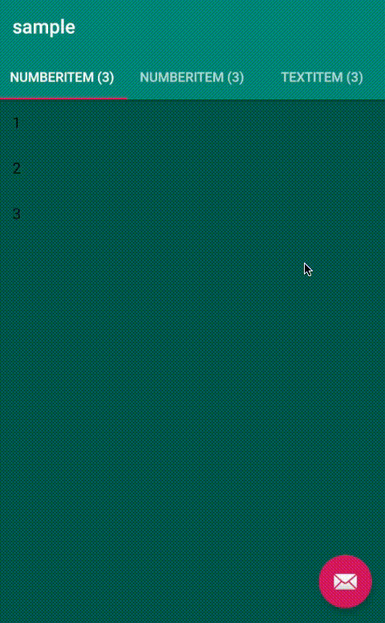

# vPager

Library to get rid of boilerplate code when writing view pagers that only contains recycler views for different pages.

## Screenshot



## Usage

With `vPager` simply do:

```kotlin
viewPager.adapter = vPagerAdapter {
    addItem(NumberItem(listOf(1, 2, 3)))
    addItem(NumberItem(listOf(4, 5, 6)))
    addItem(TextItem(listOf("Lorem", "Ipsum", "Dolor")))
}
```

`NumberItem` would then look like (`TextItem` analogue):

```kotlin
class NumberItem(items: List<Int>) : VPagerItem<Int>(items) {

    override fun filterBySearchQuery(query: String) = items.filter {
        "$it".contains(query, ignoreCase = true)
    }

    override fun getAdapter(): SearchableAdapter = NumberAdapter(items)

    override fun getPageTitle(): String = "NumberItem (${items.size})"

    override fun shouldShow(): Boolean = true
}
```
